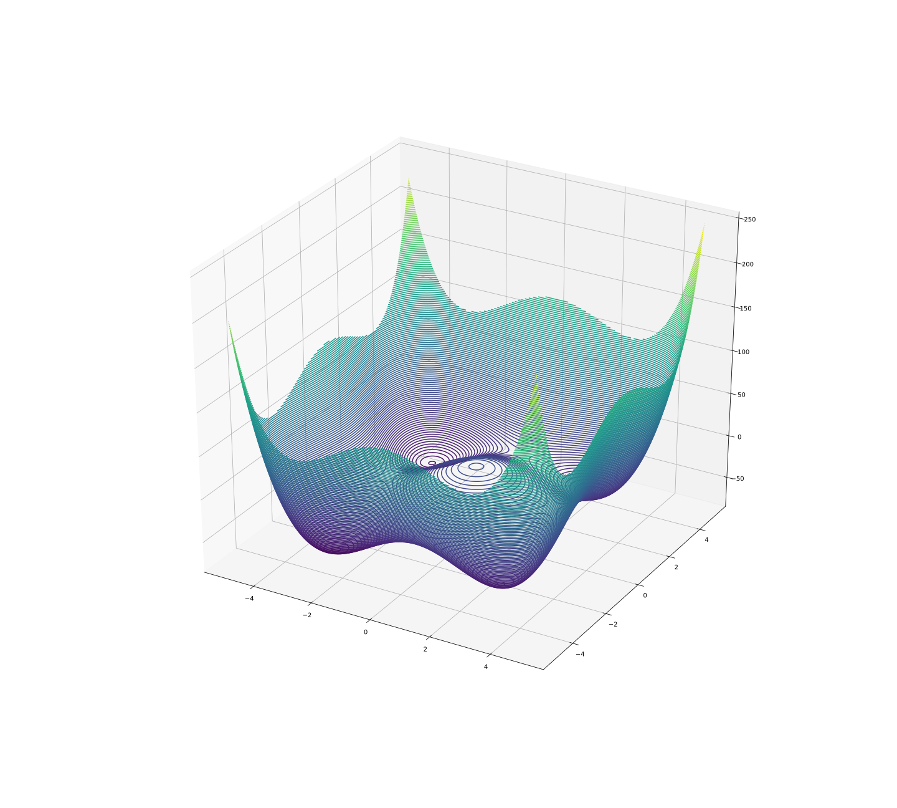

# FGA Styblinski-Tang

A função **Styblinski-Tang**[1] é uma função de benchmark para algoritmos de otimização. Seu mínimo global é conhecido [1], e dado por `-39.16599d`, onde `d` é dimensão de entrada.

<div style="text-align:center">
  
  
  <sub><sup>Fonte: autor.</sub></sup>
</div>

O software desse repositório, utiliza um Full Genetic Algorithm para tentar encontrar esse mínimo global.

## Instalando dependências

A única dependência desse software é o numpy, que pode ser instalado das seguintes maneiras:

```
pip install numpy
```
ou
```
conda install numpy
```
caso esteja utilizando um environment conda

## Execução

Para executar, basta executar o arquivo `main.py`:

```
python3 main.py
```
O comando acima irá executar com os valores padrões para os argumentos:

* np (tamanho da população) : 20
* ne (número de indivíduos elitizados) : 2
* ng (número de gerações) : 20000
* d (dimensão) : 8
* el (execução longa) : False
* i (intervalo) : 50
* v (verbose) : True
* tm (taxa de mutação) : 0.2

Para utilizar argumentos, utilize o comando `python3 main.py -h` para lhe guiar. Este, irá gerar a seguinte saída:

```
usage: main.py [-h] [-np NUM_POP] [-ne NUM_ELITE] [-ng NUM_GER] [-d DIMENSION]
               [-el] [-i INTERVALO] [-v] [-tm TAXA_MUTACAO]

FGA para encontrar o mínimo da função Styblinski-Tang-

optional arguments:
  -h, --help            Mostra essa mensagem e sai.
  -np NUM_POP, --num-pop NUM_POP
                        Números de indivíduos na população.
  -ne NUM_ELITE, --num-elite NUM_ELITE
                        Número de indivíduos selecionados por elitismo.
  -ng NUM_GER, --num-ger NUM_GER
                        Número de gerações máximas que o FGA irá executar.
  -d DIMENSION, --dimension DIMENSION
                        Número de dimensões.
  -el, --execlong       Execução longa (imprimindo a cada intervalo).
  -i INTERVALO, --intervalo INTERVALO
                        Intervalo de impressão.
  -v, --verbose         Se passado, omite o número e o melhor indivíduo de
                        cada geração assim como sua avaliação
  -tm TAXA_MUTACAO, --taxa-mutacao TAXA_MUTACAO
                        Taxa de mutação dos indivíduos
```

## Referências

* [1] [Styblinski-Tang Function](http://www.sfu.ca/~ssurjano/stybtang.html)

----

Autor: [leonamtv](https://leonamtv.github.io/leonamtv/)

